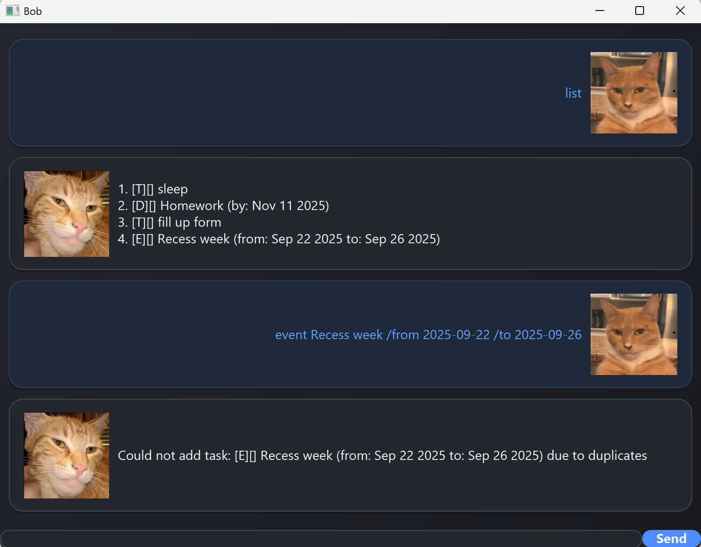

# Bob User Guide



Bob is your goto task management app! Always forget about your tasks? With Bob, you will no longer forget!

## Adding deadlines
The format for adding deadline is:
`deadline <Name of deadline task> /by <Date in YYYY-MM-DD>`

Example: `deadline Homework /by 2025-11-11`

```
Task added:
[D][] Homework (by: Nov 11 2025)
```

## Adding todo
The format for adding todo is:
`todo <Name of todo task>`

Example: `todo Fill up form`

```
Task added:
[T][] Fill up form
```

## Adding Event
The format for adding event is:
`event <Name of event task> /from <Date in YYYY-MM-DD> /by <Date in YYYY-MM-DD>`

Example: `event Recess week /from 2025-09-22 /to 2025-09-26` 

```
Task added:
[E][] Recess week (from: Sep 22 2025 to: Sep 26 2025)
```

## List all tasks
The format for listing all task:
`list`

```
1. [E][] Recess week (from: Sep 22 2025 to: Sep 26 2025)
```

## Marking task
The format for marking task as done is:
`mark <id of task>` - ID of task can be retrieved using the list command`

Example: `mark 1`

```
Task marked as done:
[E][X] Recess week (from: Sep 22 2025 to: Sep 26 2025)
```

## Unmarking task
The format for unmarking task as not done is:
`unmark <id of task>` - ID of task can be retrieved using the list command

Example: `unmark 1`

```
Task unmarked as not done:
[E][] Recess week (from: Sep 22 2025 to: Sep 26 2025)
```


## Feature ABC

// Feature details

## Feature XYZ

// Feature details
